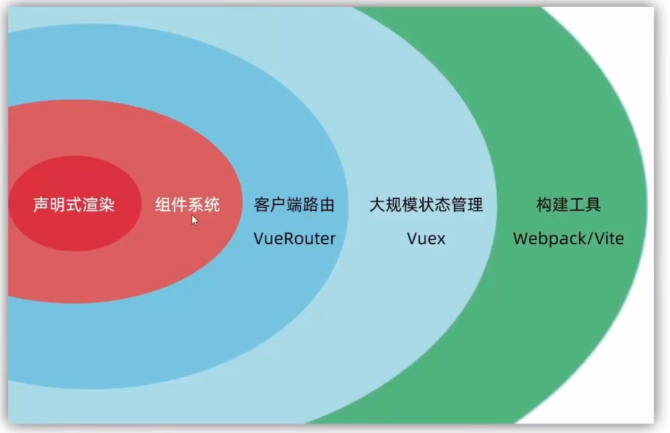
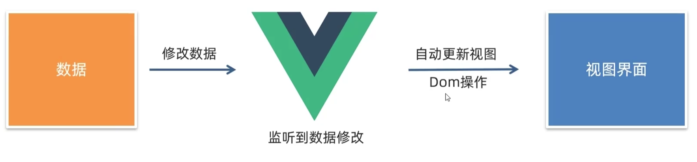
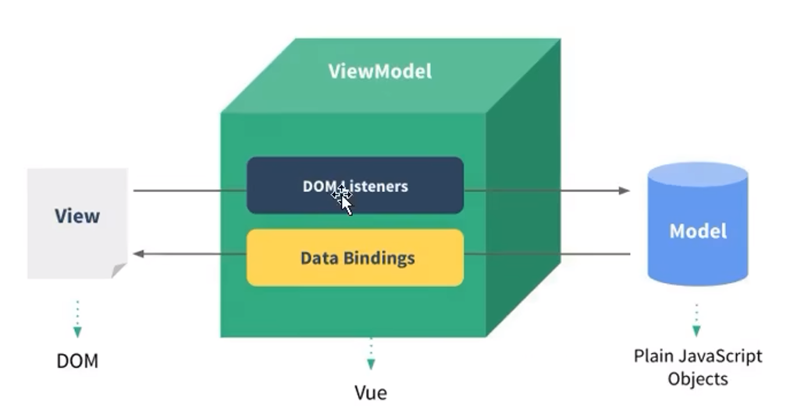

# Vue简介

**Vue是一个用于构建用户界面的渐进式框架**，Vue可以提升JS的开发效率。因为他不再需要操作DOM对象了

渐进式：循序渐进，各模块循序渐进



https://v2.cn.vuejs.org/

## Quick Start

创建一个Vue程序的步骤

1. 准备容器

```js
<div id="app">
{{msg}}
</div>
```

2. 引入Vue包

```js
<script src="../vue.js"> </script>
```

3. 创建Vue实例

`el`：配置选择器，选择控制的容器

`data`：提供数据

```js
<script>
    const app=new Vue({
        el:'#app',//通过EL配置选择器
        data:{
            msg:'hello world'
        }
    })
</script>
```

el的写法二：

```js
app.$mount='选择器'
```

```js
    const app=new Vue({
        el:'#app',//通过EL配置选择器
        data:function(){
            return{ 
            name:'张三'
            }
        }
    })
```

data函数不能写成箭头函数，因为需要使用this

## 插值语法

插值表达式是一种Vue模板语法，插值语法应用于标签体内内容（*innerText*）

```js
{{表达式}}
{{msg}}
```

```js
data:{
    msg:'hello world'
}
```

**插值表达式不能使用在HTML标签的属性中**，插值表达式替换需要渲染的文字

```js
<h1>{{title}}</h1>
```

data中写的插值表达式中需要使用的变量的值，相当于在Vue声明了一个变量

data中的数据会变为Vue实例的属性成员

访问数据

```js
app.msg='test'
```

> 插值表达式不能解析HTML标签


## 指令语法

指令语法用于**解析标签**。Vue中的指令都是`v-`开头

```html
<div id="app">
    {{info.toUpperCase()}}
    <a v-bind:href="url">百度一下</a>
</div>
```

url来自于data域中的成员

## 响应式


data中的数据变化，视图能够自动更新视图



## 数据绑定

### 单向绑定

数据只能从data流向页面，页面数据不能改变data

`v-bind`

```html
    <input type="text" v-bind:value="name">
```


### 双向绑定

数据和页面是双向流动的，页面和data可以互相影响

`v-model`，v-model只能应用在表单类元素（存在value属性）

```html
    <input type="text" v-model:value="name">
```

当`v-model`指定的是`value`时可以省略：

```html
    <input type="text" v-model="name">
```


## MVVM




View：DOM对象（页面）

VM：Vue实例

Model：data

# Vue实例

## el

选择器，选择绑定Vue实例的DOM元素

## data

声明Vue中使用的属性，属性具有响应性

## methods

声明Vue中调用的方法

## computed

声明计算属性的get和set方法


# Vue指令

## v-html
```js
<div id="app" v-html="msg">
```

```js
    const app = new Vue({
        el: '#app',//通过EL配置选择器
        data: {
            msg: '<h1>hello world</h1>',
            info: 'abc'
        }
    })
```

##  v-show

控制元素的显示与隐藏


##  v-if

条件渲染

## v-bind

`v-bind:`可以简写成`:`
