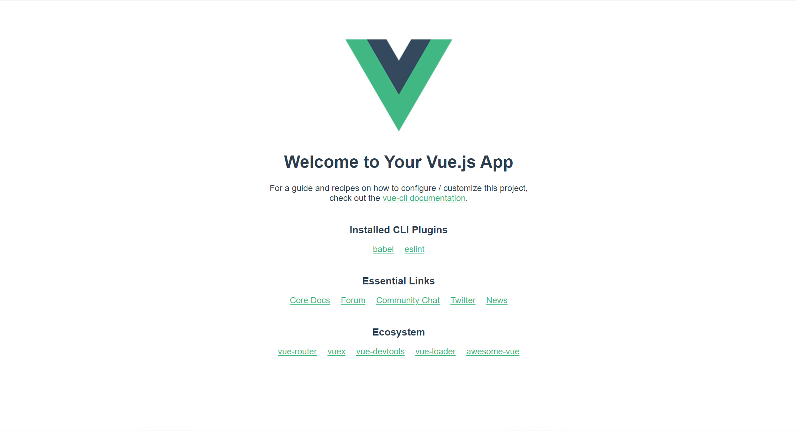

# 脚手架

脚手架的英文名*Vue.cli*，*command line interface*

脚手架版本选择最新即可

脚手架官方文档：https://cli.vuejs.org/zh/

## 安装@Vue/cli

```js
npm install -g @vue/cli
```

## 创建 脚手架

```js
vue create Vue项目名
```

vue cli将会在当前工作路径下生成该名字的项目文件夹

根据提示即可进入Vue cli的示范文件



# Vue 脚手架结构

`babel.config.js`：ES6转为ES5的工具

## package.json

script中

- serve 启动服务
- build 构建Vue工程文件
- lint 语法检查

执行 `npm run serve`命令时，将立即执行`src/main.js`

## src

### main.js

脚手架的入口

## public

html页面，存放`index.html`，`favicon.ico`页签图标

## index.html

在Vue脚手架中不需要引入main.js，不需要引入vue.js

资源和title：

```js
    <link rel="icon" href="<%= BASE_URL %>favicon.ico">
    <title><%= htmlWebpackPlugin.options.title %></title>
```

## vue.config.js

vue脚手架配置文件

- 关闭语法检查

```js
lintOnSave:false
```


## components

Vue组件文件夹，组件要求大驼峰命名

