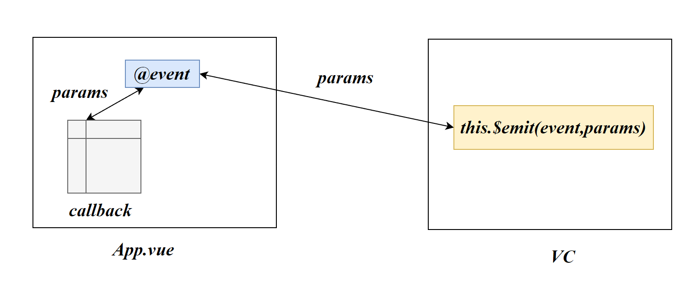
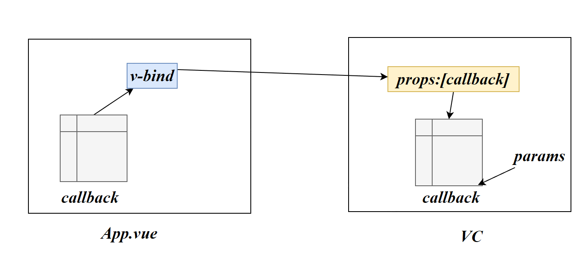

JS内置的事件是针对DOM元素的

自定义事件则是针对组件使用的

# 组件间通信

## 父→子

通过父组件给子组件传递数据，实现父->子之间的通信

## 子→父

通过父组件给子组件传递函数类型的props，子组件调用该函数，并向其传入数据，实现子->父之间的通信

```vue
//School.vue
<template>
	<div class="school">
		<h2>学校名称：{{name}}</h2>
		<h2>学校地址：{{address}}</h2>
		<button @click="sendSchoolName">把学校名给App</button>
	</div>
</template>

<script>
	export default {
		name:'School',
		props:['getSchoolName'],
		data() {
			return {
				name:'尚硅谷',
				address:'北京',
			}
		},
		methods: {
			sendSchoolName(){
				this.getSchoolName(this.name)
			}
		},
	}
```

```vue
<!-- 通过父组件给子组件传递函数类型的props实现：子给父传递数据 -->
<School :getSchoolName="getSchoolName"/>
```

```js
methods: {
        getSchoolName(name){
            console.log('App收到了学校名：',name)
        },
```

# 自定义事件

## 绑定自定义事件

给Student组件的实例对象VC绑定事件atguigu，事件触发时，将会执行getStudentName函数

```js
<Student @getName="getStudentName" /> 
```

绑定自定义事件通常在父组件中进行

## 自定义事件触发

在绑定事件的组件对象中需要我们编写如何触发事件：

```js
this.$emit('自定义事件名')
```

当Vue执行到该语句时，将会触发自定义事件

第二个参数将会向事件回调函数传入参数

```js
sendStudentName( ){
    this.$emit('getName',this.name)
}
```

this.name->getSchoolName



自定义组件可以实现子组件→父组件的信息传递。类似于第一章的子→父



# ref实现自定义组件

## ref实现

根据生命周期的知识，绑定自定义事件通常在mounted（挂载完毕）阶段

```js
$on('自定义事件类型',回调函数)
$once('自定义事件类型',回调函数)//执行一次
```

在App中为组件添加唯一标识

```js
<Student ref='student' /> 
```

我们可以在本组件的`$refs`中找到该组件对象

```js
mounted(){
    this.$refs.student.$on('getNmae','getStudentName')
}
```

自定义事件的触发的设置方式保持不变，使用`$emit`

## 优势

ref方式，可以实现异步操作

```js
mounted(){
    setTimeout({
        this.$refs.student.$on('getNmae',this.getStudentName)
    },1000)
}
```

# 解绑自定义事件

自定义事件不使用时，可以对其进行解绑

- 解绑一个事件：

```js
this.$off('自定义事件')
```

- 解绑多个事件：

```js
this.$off(['自定义事件1','自定义事件2'])
```

- 解绑该组件的所有事件：

```js
this.$off()
```

# this

## method

Vue的承诺：method中的函数的this永远是当前组件对象

## callback

当我们把回调函数不写在method，而是写在事件绑定内：

```js
mounted(){
    setTimeout({
        this.$refs.student.$on('getNmae',function(){
        console.log(this)
    } )
    },1000)
}
```

由于是Student组件触发的事件，因此该函数内的`this`执行了函数的调用者

## 箭头函数

```js
mounted(){
    setTimeout({
        this.$refs.student.$on('getNmae',()=>{
        console.log(this)
    } )
    },1000)
}
```

此时this将上一级查找，this指向了当前的组件对象

# 自定义组件绑定原生事件

自定义组件使用@原生事件名，Vue将会认为这是自定义事件，我们需要使用修饰符绑定原生事件

```js
@原生事件名.native="回调函数"
```

```js
<Student ref="student" @click-native="show">
```

