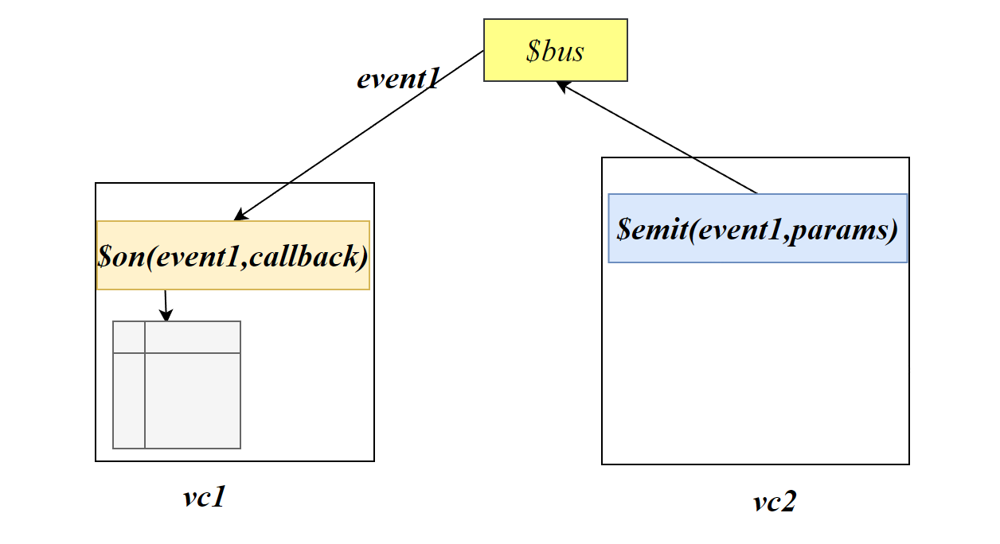

# 全局事件总线

全局事件总线可以实现任意组件间的通信



## 注册全局事件总线组件

全局事件总线组件本质是是一个VC对象

```js
const Demo=Vue.extend({

})

Vue.prototype.x=new Demo()
createApp(App).mount('#app')
```

```js
const app=createApp(App).mount('#app')
app.config.globalProperties.$bus = new app;
```

全局所有的组件都将存在`$bus`组件

## bus绑定事件

```js
this.$bus.$on('事件名',回调函数)
```

## bus触发事件

```js
this.$bus.$emit('事件名',数据)
```

## bus关闭事件

bus由于需要一直存在，因此建议及时关闭事件

```js
beforeDestroy(){
    this.$bus.$off('事件名')
}
```

# 消息订阅与发布

## 创建环境

pubsub-js

```js
npm i pubsub-js
```

```js
import pubsub from 'pubsub-js'
```


## 消息订阅

订阅消息：消息名

发布消息：消息内容

```js
method(){
    pubsub.subscribe('消息名',function(消息名,数据){
        
    })
}
```

```js
method(){
    pubsub.subscribe('hello',function(msg,data){
        
    })
}
```

消息订阅函数将得到`消息id`

## 消息发布

```js
method(){
    pubsub.publish('消息名',params)
}
```

消息发布后，该消息名关联的回调函数将把params作为callback的实参传入，并执行回调函数

## 取消消息定阅

```js
pubsub.unsubscrible(消息id)
```

