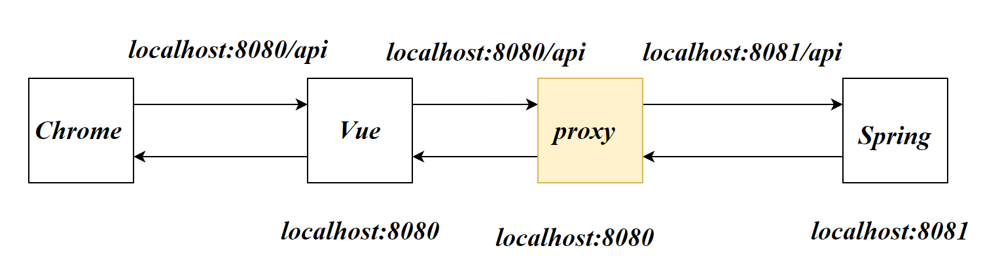

# 跨域问题

## 浏览器发送请求

当用户在浏览器中点击网页上的按钮时，通常会触发JavaScript代码，该代码可以发起HTTP请求。这个请求是由用户的浏览器发送的，因为JavaScript代码是在浏览器中执行的。

## 同源策略

> **同源**：
>
> **协议**、**域名**、**端口**都相同称为同源。

浏览器具有同源策略：

如果**请求的目标**与当前页面不同源，**浏览器就会阻止这种跨域请求**

具体来说：浏览器发送了跨域的请求，跨域服务器实际上收到了该请求，并返回响应。浏览器发现该响应与当前页面的域不同后便会检查响应头是否存在*CORS*的标头，如果没有便会阻止（拦截）该响应。


实际开发中，Vue和Springboot是两个独立的应用会部署在不同的域上。跨域的问题是我们必须要解决的。

## CORS

CORS策略（Cross Origin Resource Sharing），跨域资源共享。一种后端服务器解决跨域资源访问的策略

也是一种后端服务器保证数据安全的策略。通过对服务器配置CORS策略可以让浏览器对响应进行拦截：CORS实现了浏览器层面获取服务器**敏感数据**的安全问题——敏感数据保存在响应中，而浏览器阻止了响应的获取。

在服务器返回的响应头中设置：

- *Access-Control-Allow-Origin*

  允许的请求源，value=URL

- *Access-Control-Allow-Methods*

  允许的请求方式

- *Access-Control-Allow-Headers*

  允许的头部中存在哪些信息

```js
res.setHeader('Access-Control-Allow-Origin','http://localhost:63342')
res.setHeader('Access-Control-Allow-Methods','GET, POST, PUT, DELETE')
res.setHeader('Access-Control-Allow-Headers', 'Content-Type,Authorization')
```

浏览器接收到响应时，会对*CORS*策略进行判断，如果**请求**不满足响应的*CORS*策略将会阻止该响应的获得


## 代理服务器

在前端处添加一个同位置的代理服务器（同端口，同host），浏览器向代理服务器请求数据，浏览器不会触发同源策略

服务器与服务器之间通信没有同源策略



# 配置代理

## 配置代理


`vue-cli`可以为我们开启代理服务器

在`vue.config.js`配置devServer.proxy

```js
module.exports = {
  devServer: {
    proxy: 'http://localhost:8081'
  }
}
```

proxy写的是将请求转发给哪一个服务器？例如后端的某个服务URL

代理服务器不是将所有的请求都转发给后端，当Vue的public中存在所要请求的资源时，他将不会转发。

>  该代理服务器配置不能设置转发多个服务器


## 配置更多代理

```js
module.exports = {
  devServer: {
    proxy: {
      '/api': {
        target: '<url>',
        pathRewrite:{'^/api':' '},
        ws: true,
        changeOrigin: true
      },
    }
  }
}
```

- `/api`请求前缀，控制不同的代理行为

- `target`：后端目标服务器URL

  ```js
  localhost:8080
  ```

- `pathRewrite`，路径重写，如果路径不重写，将带有前缀`/api`

  ```js
  pathRewrite:{
      '^/api':' '
  }
  ```

- `ws`：websocket
- `changeOrigin`，true：告诉转发目标，自己的host是target，false：真实告诉转发目标自己的host


