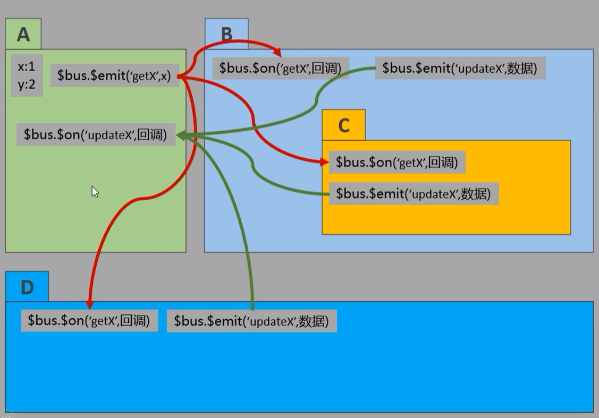
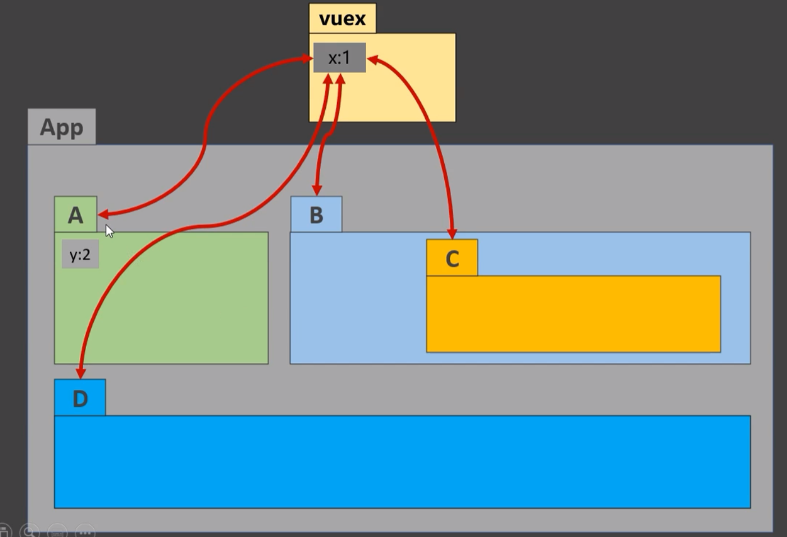
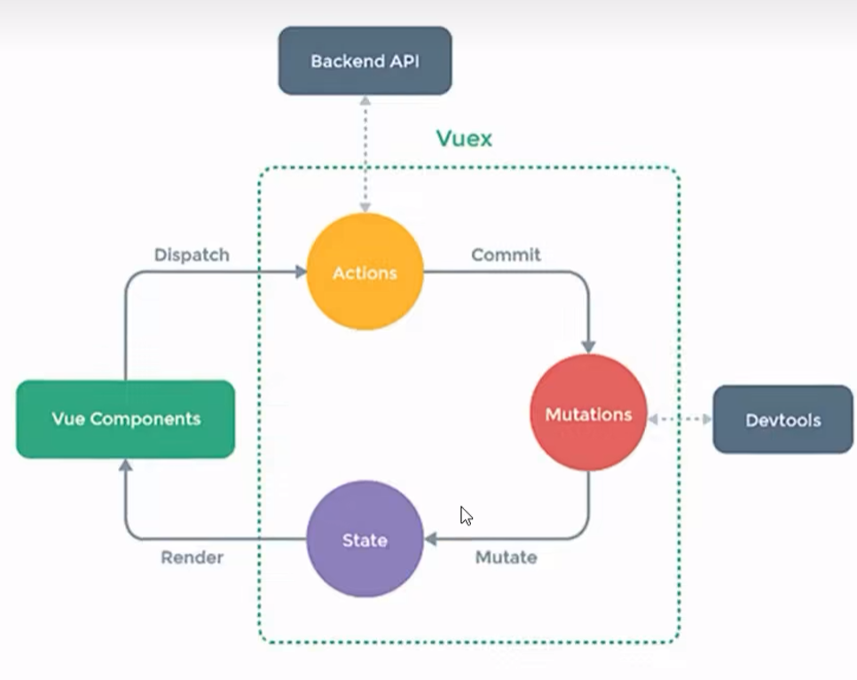
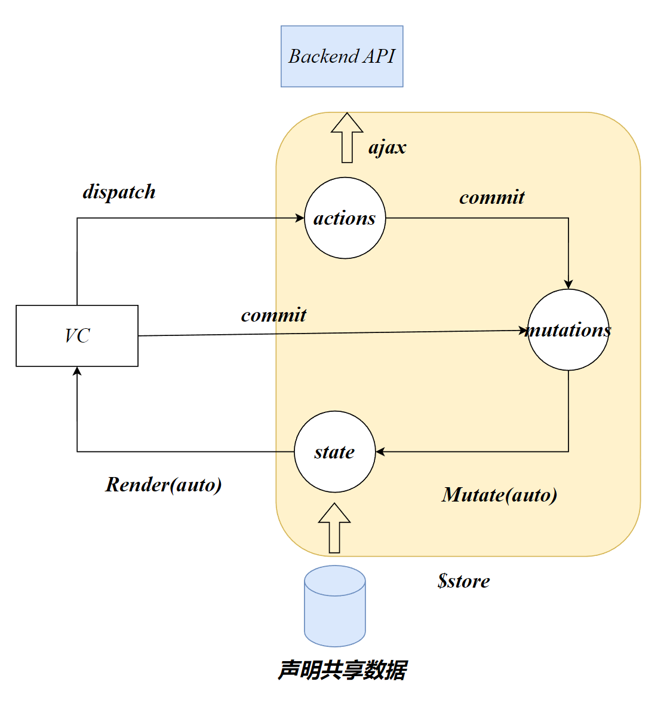

# vuex

## bus实现数据共享

在vue中实现集中式状态（数据）管理的vue插件

多个组件的共享状态进行集中式的管理（读/写），也是一种组件间通信方式，且适用于任意组件间的通信




数据x，y实现了**多组件共享数据**（读/写）

## 什么时候使用vuex

vuex不属于任何组件。

当某些数据需要在多个组件间使用，则可以将该数据声明在vuex



# vuex原理



都是对象：

Actions：行为

Mutations：加工

State：状态

使用vuex进行数据共享需要将数据交给Vuex中的`State`对象管理

---

VC：客人

Action：服务员

Mutations：厨师

State：菜

客人可以直接与厨师沟通

# vuex环境搭建

## /store/index.js

```js
import Vuex from 'vuex'
import Vue from 'vue'
// 该文件用于创建store对象
//准备Actions：用于响应组件中的动作
const actions={}
//Mutation：用于操作数据
const mutations={}
//用户存储数据
const state={}
// 创建store
Vue.use(Vuex)
export default new Vuex.Store({
    actions,
    mutations,
    state,
}) 
```

创建store对象之前，必须注册vuex插件

## main.js

如果在Vue2中使用vuex，请下载vuex 3

```js
npm i vuex@3
```

传入`store`配置对象，vm将挂载`$store`属性

```js
import Vue from 'vue'
import App from './App.vue'
// 关闭生产环境提示
Vue.config.productionTip = false
import store from './store'

new Vue({
  render: h => h(App),
  store,
}).$mount('#app')

```


# vuexAPI



## Store

Store，译为仓库，是vuex中管理state对象、mutations对象、actions对象的对象

```js
Vue.use(Vuex)
export default new Vuex.Store({
    actions,
    mutations,
    state,
}) 
```

在Vue中使用了vuex插件后，可以在每一个组件实例中找到`$store`

## state

状态，数据存放的位置

```js
const state={
    msg:'',
}
```

在state内，每一个变量都是一个对象。其使用了数据代理的方式。

## actions

actions中声明的是业务逻辑处理函数，Ajax等

actions中方法第一个形参为context，上下文，用于调用`commit`方法。第二个形参为dispatch传入的数据

commit将会把数据传入指定的mutation函数，并立即执行

```js
//准备Actions：用于处理业务逻辑，例如ajax
const actions={
    join(context,value){
        console.log('actions的join被调用了',context,value);
        context.commit('JOIN',value)
    },
    joinWait(context,value){
        setTimeout(()=>context.commit('JOIN',value),1000)
    }
}
```

在Vue中可以使用`dispatch`向actions中的行为函数传入组件内的数据

```js
this.$store.dispatch('actions中的方法名',组件内数据)
```

当执行dispatch时，它会将数据作为指定actions方法的第二个形参并执行该方法

```js
  methods: {
    fun() {
      this.$store.dispatch("join", this.str);
    },
    funWait() {
      this.$store.dispatch("joinWait", this.str);
    },
  },
```

## mutation

`commit`函数第一个形参为`mutation`内声明的方法名，方法名通常使用全大写

用于对state内的数据进行直接修改。属于数据层操作

```js
//Mutation：用于操作数据
const mutations={
    JOIN(state,value){
        console.log('JOIN被调用了',state,value);
        console.log('----------------');
        state.msg += value
    }
}
```

mutation内声明的函数第一个形参为state，第二个形参为commit传入的value

---

当VC没有业务逻辑，只要对数据进行修改，可以直接调用commit函数

```js
this.$store.commit('mutation中的方法名',组件内变量)
```

## vuex devtools

在vue浏览器插件中可切换至vuex插件开发者工具

# 优化vuex

```js
<h1>{{ $store.state.msg }}</h1>
```

计算属性是根据已知的属性计算得到新的属性，因此我们可以使用计算属性通过对state内的属性进行return，就可以直接在组件中使用了

```js
computed:{
    msg(){
        retrun $store.state.msg
    }
}
```

```js
<h1>{{ msg }}</h1>
```

