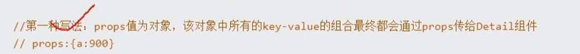

# SPA

Single page web application 单页面应用。


- SPA应用只有一个完整的页面
- 点击页面中的导航链接不会刷新页面，只会在页面的局部刷新
- 数据需要通过ajax请求获取

# router

## 前端路由


## 后端路由


# vue-router

## 安装

vue-router是vue的一个插件

```shell
 npm i vue-router@3
```


## 创建router

在src中创建router文件夹。并在`index.js`中编写：

```js
import VueRouter from 'vue-router'
import ShowA from '../components/ShowA'
import ShowB from '../components/ShowB'
export default new VueRouter({
    routes: [
        {
            path: '/a',
            component:ShowA,
        },
        {
            path:'/b',
            component:ShowB,
        }
    ]
})
```

- path路由的key
- component路由的value

路由器对象中有路由表（数组）routes。存放了多个路由关系

## 注册路由插件

```js
import Vue from 'vue'
import App from './App.vue'
import VueRouter from 'vue-router'
import router from './router'
Vue.config.productionTip = false
Vue.use(VueRouter)
new Vue({
  render: h => h(App),
  router,
}).$mount('#app')

```

当URL中出现`#`时，表示路由已正常工作：

```js
http://localhost:8080/#/
```

## router-link

如果需要使用路由，需要使用router-link标签

```js
    <router-link to="/a">点击切换A</router-link><br>
    <router-link to="/b">点击切换B</router-link>
```

`to`表示目标URL，需要写在路由表中的path

`router-link`最终会被渲染成a标签，因此与a标签的用法基本相同，样式与a标签相同，href属性变成了to属性

```js
http://localhost:8080/#/a
http://localhost:8080/#/b
```

- `active-class`属性：该元素被激活时的样式

```js
    <router-link active-class="active" to="/a">点击切换A</router-link><br>
    <router-link active-class="active" to="/b">点击切换B</router-link>
```

## router-view

指定component在组件中的位置

```js
<template>
  <div id="app">
    
    <router-link to="/a">点击切换A</router-link><br>
    <router-link to="/b">点击切换B</router-link>
    <div>
      <h1>router-demo:</h1>
      <hr />
      <router-view></router-view>
    </div>
  </div>
</template>
```

组件A和组件B就可以渲染在router-view的位置了

# vue 组件分类

## 路由组件

我们可以将ShowA和ShowB组件称为路由组件

可以将这些组件放入`components/pages`

不用的路由组件实际是被销毁（生命周期：destroy）了

路由组件都有自己的$router属性，存储自己的路由信息

整个应用只有一个router


# 多级路由

路由是指组件与url的映射，在路由内还可以创建路由，形成路由的嵌套

## 多级路由的声明

使用`children`在一级路由下创建子路由，children我对象数组：

子路由的path不需要写`/`

```js
export default new VueRouter({
    routes: [
        {
            path: '/a',
            component:ShowA,
            children:[
                {
                    path:'news',
                    component:NewsList
                },
                {
                    path:'message',
                    component:MsgList
                }
            ]
        },
        {
            path:'/b',
            component:ShowB,
        }
    ]
})
```

在ShowA组件中声明了两个子路由，news组件的path为`/a/news`，msg组件的path为`/a/message`

## 使用多级路由

在声明子路由的组件中，使用router-link在View中呈现，并使用`<router-view>`标识子路由位置

```js
<template>
    <div>
        <p>Hello,A</p>
        <router-link to="/a/news">click to NewsList</router-link><br>
        <router-link to="/a/message">click to MsgList</router-link>
        <hr>
        <router-view></router-view>
    </div>
</template>
```

# 命名路由

在创建路由时，我们可以给路由起名字，使用`name`关键字：

```js
import VueRouter from 'vue-router'
import ShowA from '../components/ShowA'
import ShowB from '../components/ShowB'
import NewsList from '../components/NewsList'
import MsgList from '../components/MsgList'
import DisplayDetail from '../components/DisplayDetail'
export default new VueRouter({
    routes: [
        {
            name:'section-a'
            path: '/a',
            component:ShowA,
        {
            name:'section-b',
            path:'/b',
            component:ShowB,
        }
    ]
})
```

我们给路由起了名字，就可以直接中简写路由的跳转

```js
        <router-link :to="{
           <!-- path:'/a/message/detail',-->
            name:'detail',
            query:{
                id:m.id,
                title:m.title
            }
        }">{{ m.title }}</router-link>
```


# 路由传参

## query

###  路由传参

使用query对象向目标组件传入参数

```js
<template>
  <div>
    <ul>
      <li v-for="m in message" :key="m.id">
        <!-- <router-link :to="`/a/message?${m.id}&title=${m.title}`">{{ m.title }}</router-link> -->
        <router-link :to="{
            path:'/a/message/detail',
            query:{
                id:m.id,
                title:m.title
            }
        }">{{ m.title }}</router-link>

      </li>
    </ul>
    <router-view></router-view>
  </div>
</template>
```

使用模板字符串

```js
<router-link :to="`/a/message?${m.id}&title=${m.title}`">{{ m.title }}</router-link>
```

### 组件得参

使用$route得参：

```js
$route.query.参数名
```

该组件得到了router-link传来的参数

```js
<template>
    <div>
        <ul>
            <li>msgid：{{ $route.query.id }}</li>
            <li>msgtitle：{{ $route.query.title }}</li>
        </ul>       
    </div>
</template>
<script>

export default{
    name:'DisplayDetail',
}
</script>
```

## params

```js
<router-link :to="`/a/message/参数1/参数2`">{{ m.title }}</router-link>
```

为了防止参数当作path，我们需要在创建路由时设置占位符

```js
name:detail
path:'/a/messsage/:id/:title'
component:Detail
```

path表示在`/a/messsage/`后的第一个参数是`id`，第二个参数是`title`

在params中 会以占位符的名称为key，URL中传入的参数为value

使用params对象，该方式只能使用`name`表示路径，不能使用path：

```js
        <router-link :to="{
            name:'detail',
            params:{
                id:m.id,
                title:m.title
            }
        }">{{ m.title }}</router-link>
```

组件得参：

```js
$route.params.参数名
```

## props

### props为对象



### props为布尔

props用于简化组件获取参数

props配置项写在创建路由的文件中

```js
props=true
```

若props为真，则会把该路由收到是所有params参数，以props形式传给组件

在V实例在就可以写：

```js
props:['id','title']
```

### pops为函数

```js
props(){
    return {
        id:666,
        title:'XMN'
    }
}
```

动态参数：

```js
props($router){
    return {
        id:$router.query.id,
        title:$router.query.title,
    }
}
```

解构：

```js
props({query:{id,title}}){
    return {
        id,
        title
    }
}
```

