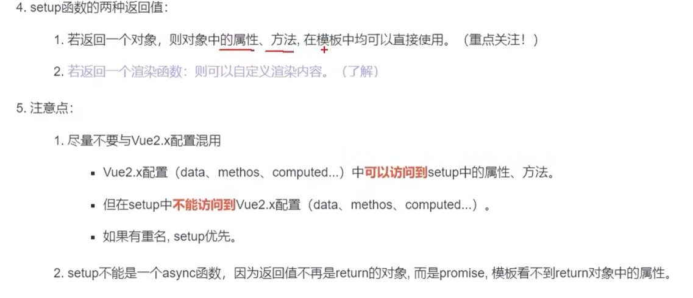
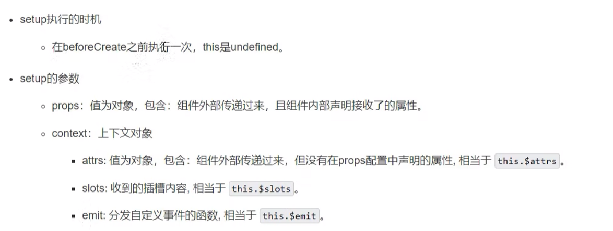
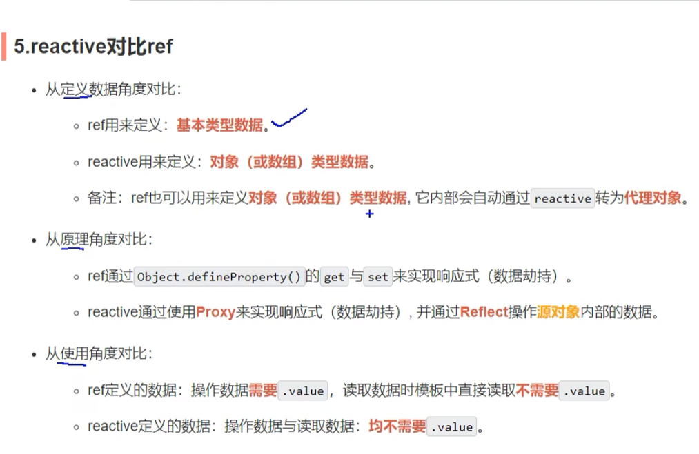
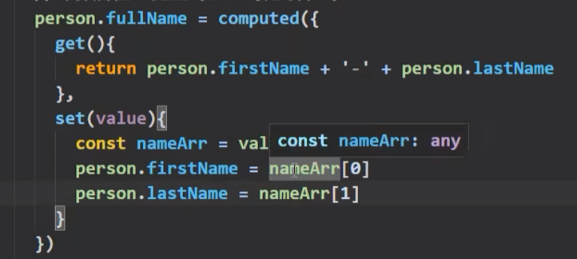
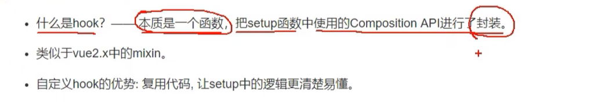
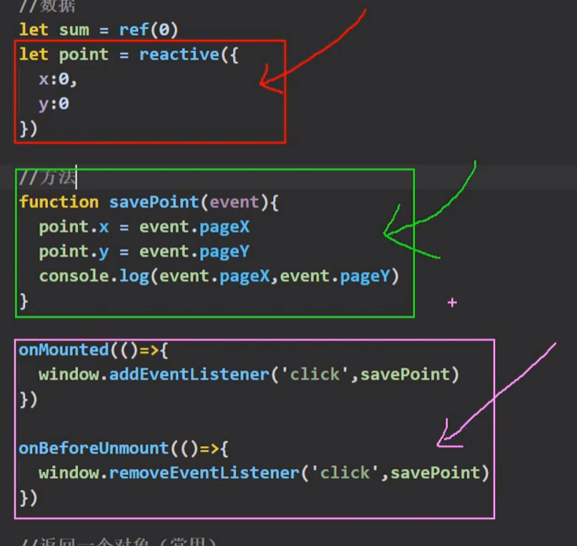
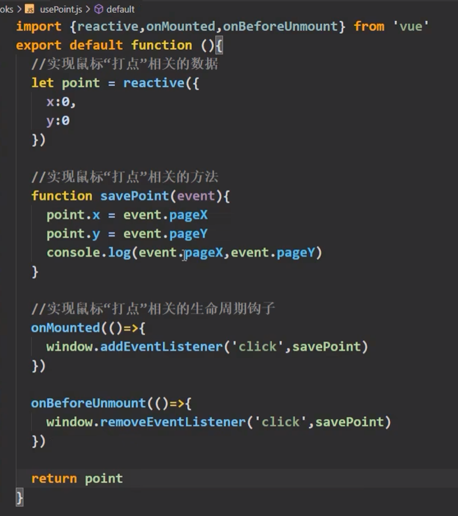
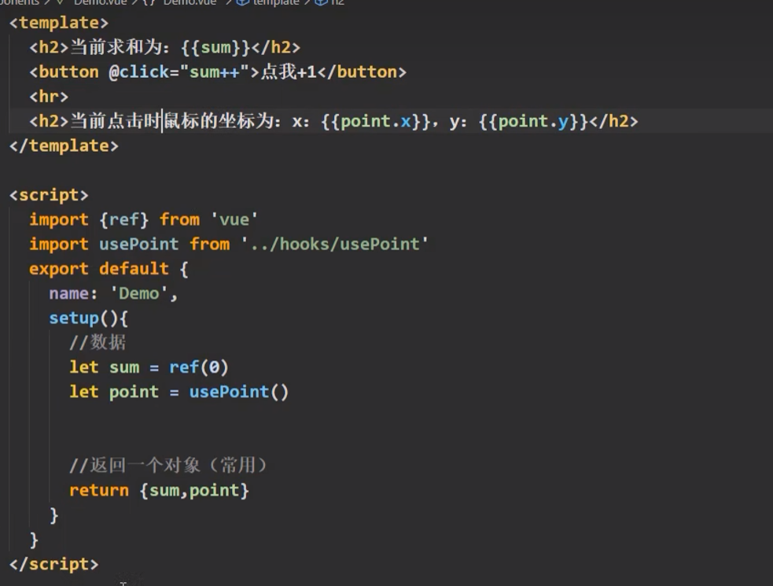

# setup

setup的组合式API表演的舞台

setup是一个配置项，是一个函数

组件中的数据、方法均需要配置在`setup`中

```js
export default {
  name: 'App',
  setup(){
    let name ='Vue世界'
    let age=12
    return {
      name,
      age,
    }
  },
}
```

Vue2风格的配置可以读取到Vue3风格的配置，Vue3读取Vue2的配置存在问题。Vue3的优先级更高



```js
props:['msg','school']
setup(props,context){
    
}
```

```js
context.emit('自定义事件名',参数)
```

在组件内需要声明被绑定的事件名：

```js
emits:['自定义事件名']
```


# ref函数

如何将数据变为响应式数据？

```js
import {ref} from 'vue'
```

```js
export default {
  name: 'App',
  setup(){
    let name =ref('Vue世界')
    let age=ref(12)
    return {
      name,
      age,
    }
  },
}
```

name和age变成了`RefImpl`的实现对象

修改响应式数据：

```js
name.value='李四'
```

在View中不需要添加`.value`，它能够自动解析

引用数据类型的响应式：

```js
job=ref({
    type:'Java'
})
```

```js
job.value.type='C++'
```

# reactive



```js
let data=reactive({
   name:'lai'
    age:12
})
```

# computed

需要引入computed模块

在setup中声明：

```js
let fullName=computed(()=>{
    return person.firstName+' '+person.lastName
})
```

如果person是reactive声明的：

```js
person.fullName=computed(()=>{
    return person.firstName+' '+person.lastName
})
```

完整写法：



```js

```

# hook函数





合并成一个模块，

hooks文件夹中的文件名为`useXXX.js`





组件之间可以公用某个模块