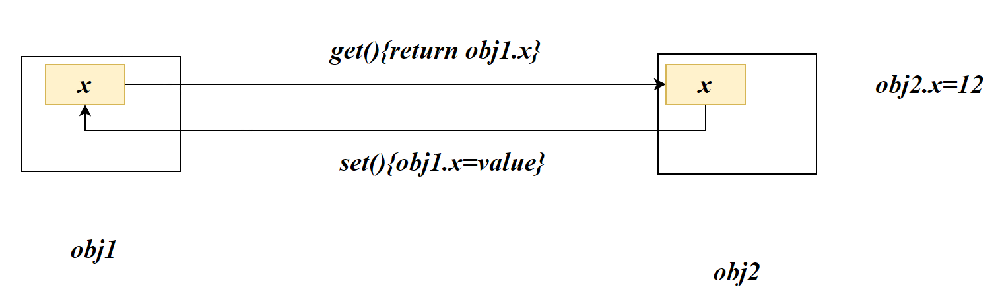
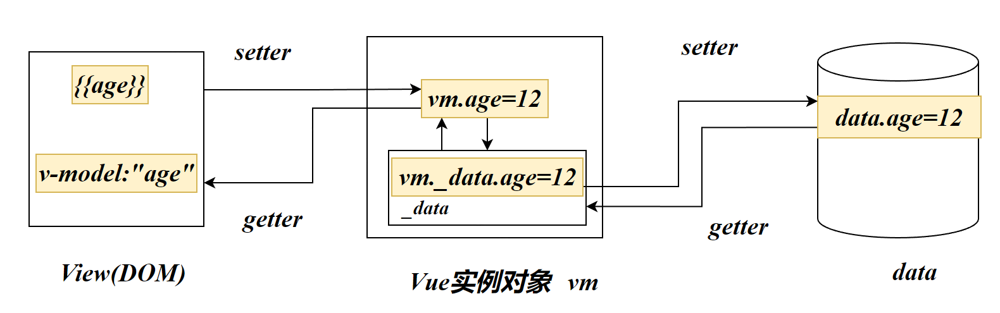

# 数据代理原理

## defineproperty

Object中存在一个方法：`defineproperty`。可以为对象添加属性

```js
Object.defineproperty(对象,'属性名',{
    //该属性相关元数据的对象
})
```

```js
let pseron={
	name:'张三',
	sex:'男'
}
```

设置了person对象的age属性，值（value）为10：

```js
Object.defineproperty(person,'age',{
    value:10
})
```

- `enumerable`

  控制对象中的一个属性是否可以枚举，例如遍历(for)

- `writable`

  控制对象中的一个属性是否可以被修改

  ```js
  Object.defineproperty(person,'age',{
      value:10
  })
  person.age=12
  console.log(age)
  //10
  ```

- `configurable`

  控制属性是否可以被删除

- `get`

  当读取该属性时，将会调用get对应的函数

  ```js
  //默认下的get方法：
  get(){
      return value
  }
  ```

- `set`

  当设置该属性时，会调用set所对应的函数

  ```js
  set(value){
      number=value
  }
  ```

  


## 比较

```js
Object.defineproperty(person,'age',{
    value:10,
    enumerator:true,
    configurable:true,
    writable:true
})
```

```js
user.age=10
```

两者的作用是相同的。但是我们为什么要使用如此麻烦的`defineproperty`去添加属性呢？

## 引入

现在我们需要完成一个需求：person对象的age需要与number的值的同步

我们可能会这样想：

```js
let number=10
let pseron={
	name:'张三',
	sex:'男',
         age:number
}
number=19
```

执行完JS代码后，可以发现person对象中的age并没有变为number最后的值：19

显然传统方式并不能完成相关的需求

我们可以使用`Object.defineproperty`实现该功能：

- `get`

  ```js
      get(){
          console.log('调用了该getter函数')
          return number
      },
  ```

  

- `set`

  ```js
      set(){
          console.log('调用了setter函数');
          number=value
      }
  ```

  

## 数据代理

通过一个对象，对另一个对象中属性的操作（读/写）进行了代理



ob2是obj1的代理者，修改obj2中的*x*会间接影响obj1中的*x*，读取obj2的*x*会得到obj1的*x*。这就是**数据代理**

# Vue数据代理

数据代理实现了数据的双向绑定，即响应式数据



- data中的成员将存至vm对象的`_data`成员对象中
- 根据`_data`中的**成员属性**，将同步至vm对象中

```js
console.log(app.age)//12
console.log(app._data.age)//12
```

