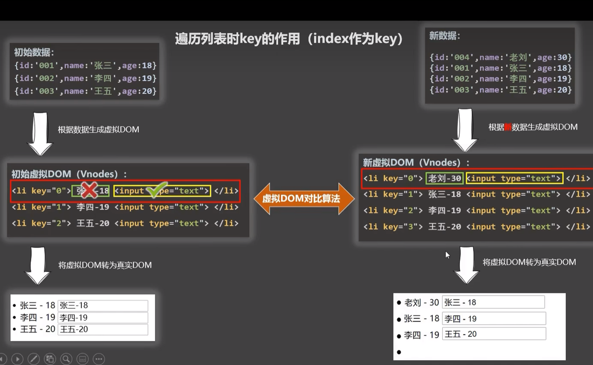
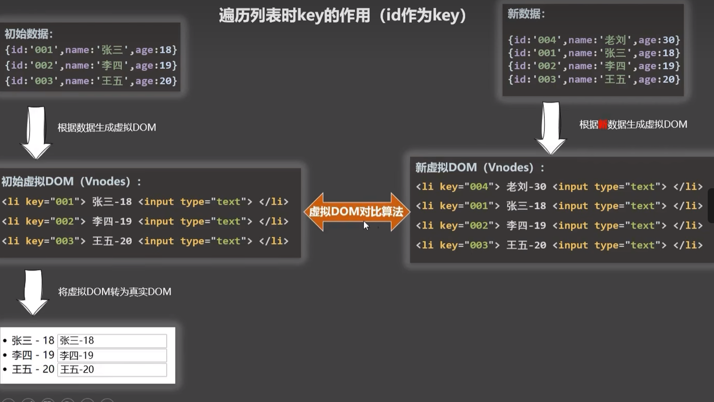
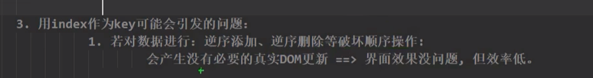
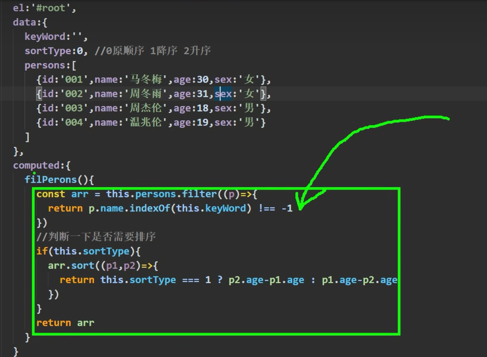

# class

## 单个可变样式

```js
class="basic" v-bind:class="mood"
```

mood来自data

## 多个样式

```js
class="basic" v-bind:class="array"
```

字符串数组

```js
array:['style1','style2',...]
```

操作样式变成了操作数组，极大的简化了我们应用样式

## 切换样式

绑定的样式个数确定，样式名称也确定，动态控制样式的启用（切换样式）

```js
array:{
    style1:false
    style2:true
}
```

true表示启用该样式

false表示关闭该样式  

# style

## style对象


```js
<span style="font-size: 40px;">{{fullname()}}</span>
```

**我们可以使用Vue托管行内样式**

```js
<span style="style1">{{fullname()}}</span>
```

```js
data:{
    style1:{
        fontSize:'40px'
    }
}
```

style将其封装成一个对象，对象中存储样式属性key:value

style中的样式如果有多个单词（使用-连接），转为小驼峰命名即为Vue中样式名称，

## style 数组

style数组中可以存放data中声明的CSS样式对象

```js
data: {
    style1:{
        fontSize:'40px',
        color:'red',

    },
    style2:{
        backgroundColor:'orange'
    }
},
```

```js
<span style="[style1,style2]">{{fullname()}}</span>
```

# 条件渲染

## v-show

表达式为true则显示该DOM元素，表达式为false则隐藏该DOM元素

```js
v-show="表达式"
```

```js
 <span v-show="false">Hello</span>
```

其原理是设置了CSS中的 `display`值

## v-if

表达式为false，则从DOM树中直接删除，表达式为true则渲染该DOM元素

```js
v-show="表达式"
```

如果元素需要经常切换显示，则使用v-show。

## v-else-if

在Java中 if-elseif的逻辑是从上往下依次判断条件，如果其中有一个条件成立，则剩下的条件将不再执行

在Vue中，也是如此

```js
        <span v-if="i<10">Hello</span>
        <span v-else-if="i<20">Hello</span>
        <span v-else-if="i<30">Hello</span>
```

如果i<10成立，则剩下的两个条件将不再执行判断，只打印一个Hello

## v-else

与Java中 else用法相同，else（否则）不需要写条件，常和`v-if`和`v-else-if`配合使用

```js
        <span v-if="i<10">Hello</span>
        <span v-else-if="i<20">Hello</span>
        <span v-else-if="i<30">Hello</span>
        <span v-else>Hello</span>
```

使用v-if/v-else-if和v-else时，标签之间不能被打断

`v-show`不能和`v-else`配合使用

## template

HTML中的模板标签，不影响页面结构。`template`用于封装批量渲染的标签，标签的条件都相同

在template中只能使用v-if，不能使用v-show

```js
        <span v-if="i===1">Hello</span>
        <span v-if="i===1">Hello</span>
        <span v-if="i===1">Hello</span>
        <span v-if="i===1">Hello</span>
```

```js
        <template v-if="i===1">
            <span >Hello</span>
            <span >Hello</span>
            <span >Hello</span>
            <span >Hello</span>
        </template>
```

# 列表渲染

## v-for

### 遍历数组/对象

循环遍历的两种写法：

```js
v-for="item in items"
```

```js
v-for="(item,index) in items"//items是数组
v-for="(value,key) in items"//items是对象
```

- `item`每轮循环的元素
- `items`循环数据池，**对象**、**数组**
- `index`元素对应的索引
- `key`：对象的key
- `value`：对象的value

```js
        <ul>
            <li v-for="p in persons">姓名:{{p.name}} 年龄：{{p.age}}</li>
        </ul>
```

```js
persons:[
{id:'01',name:'Sam',age:12},
{id:'02',name:'Amy',age:15},
{id:'03',name:'Xud',age:13},
]
```

### 遍历指定次数

```js
<li v-for="(number,index) in 次数"></li>
```

遍历了5次：

```js
<li v-for="(number,index) in 5">Hello</li>
```


## key

### key的声明

声明key，为标签结点添加**唯一标识**

```js
        <ul>
            <li v-for="p in persons" ::key="p.id"></li>
        </ul>
```

### 虚拟DOM

key用于Vue内部，因此key属性不会渲染在HTML页面中

### differ算法





如果没有写key，则会把遍历时的索引值作为key



---

P31 列表过滤

p32列表排序



# 响应式原理（监听）

## 引入

改变数组中元素的地址，Vue将监听不到数据的改变

```js
person[0]={id:'1',name:'lai',age:12,sex:'F'}
```

# Vue表单

## 输入类

使用v-model代替value

## 选择类 

除了本身的value属性需要存在，还需要添加v-model进行数据绑定，用于接收选择的value

```html
        <input type="radio" name="sex" v-model="sex" value="M">男<br><br>
        爱好：<input type="checkbox"  v-model="hobby" value="study">学习
        <input type="checkbox"  v-model="hobby" value="games">游戏
        <input type="checkbox"  v-model="hobby" value="eat">吃饭
```

```js
        const vm = new Vue({
            el: 'form',
            data: {
                username: '',
                password: '',
                sex: '',
                hobby:[],
            }
        })
```

## v-model修饰符

- `number`

```js
年龄：<input type="number" v-model.number="userInfo.age">
```

- `lazy`

失去焦点时，再进行响应式更新

- `trim`

去掉前后的空格

```js
姓名：<input type="text" v-model.trim="userInfo.name"> 
```

# 过滤器

## Day.js


## 过滤器

过滤器在Vue3已废弃

```js
{{data属性 | 过滤器名}}
```

在Vue中添加配置项

```js
filters:{
    过滤器名(value){
        //函数体
    }
}
```

获得data属性后，Vue会将data属性作为实参传入过滤器函数。过滤器返回值将替换整个表达式：`data属性 | 过滤器名`

- 多个过滤器串联：

```js
属性|过滤器1|过滤器2|...
```

属性->过滤器1->过滤器2

- 声明全局过滤器，必须声明在Vue实例创建之前

```js
Vue.filter('过滤器名',过滤器函数)
```

