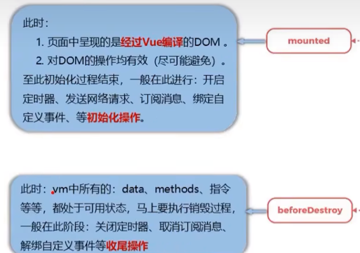

# 生命周期

Vue在不同的生命周期会调用不同的生命周期函数，也称生命周期钩子（Vue将函数钩出）

- beforeCreate
- created
- beforeMount
- mounted
- beforeUpdate
- updated
- beforeDestroy
- destroyed


# mounted

## beforeMount


## mounted


mounted是Vue中的挂载配置项

Vue完成模板解析并把真实DOM放入页面后，调用mounted

```js
mounted(){
    console.log('挂载了')
}
```



# destroy

## beforeDestroy

