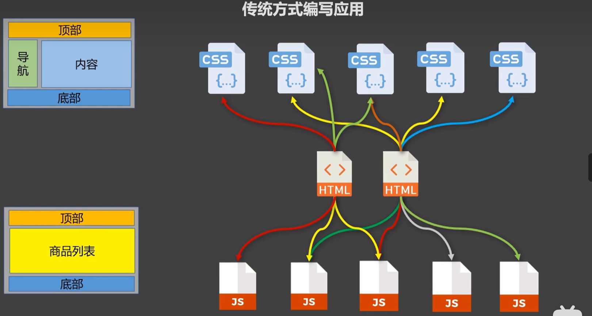
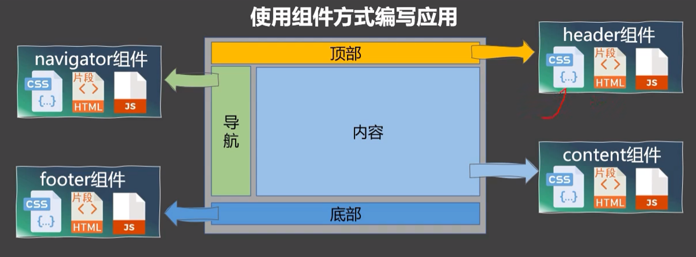
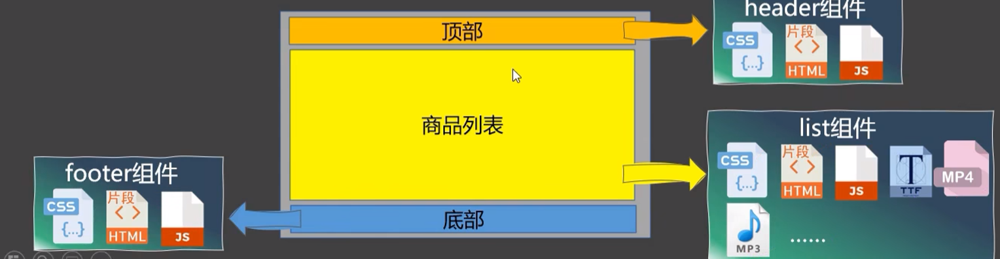
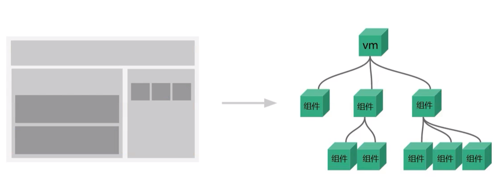

# 组件

## 传统应用



存在的问题：

- 依赖关系混乱，不好维护
- 代码复用率（HTML文档）不高

## 组件化





组件是实现应用局部功能代码和资源的集合

## Vue组件



# Vue组件

## 非单文件组件

一个文件中包含多个组件

> 组件就是一块砖哪里需要哪里搬


### 创建组件

组件由组件的HTML结构和数据组成

```js
const school=Vue.extend({
            template:`
            <div class="demo">
                <h2>学校名称：{{schoolName}}</h2>
                <h2>学校地址：{{address}}</h2>
                <button @click="showName">点我提示学校名</button>	
            </div>
        `,
    data(){
        return{
            schoolName:'北京大学',
            address:'北京'
        }
    }
})
```

`el`：不需要写el配置项，最终所有的组件都会被vm管理，由vm决定服务于谁

`data`：必须使用函数式（函数作用域）

### 注册组件（局部）

`components`

```js
new Vue({
    el:'#root'
    components:{
    school:school,//第二个school是组件创建的名称
    student//属性简写
}
})
```

### 注册组件（全局）

注册全局组件需要写在创建Vue实例前面

```js
Vue.components('组件标签名',组件变量)
```

```js
Vue.components('school',school)
new Vue({
    //配置项
})
```

全局注册的组件可以在所有的Vue实例中使用

### 使用组件

编写组件标签

```html
<div id="root">
    <school> </school>
</div>
```

组件标签会被template中的结构所替代，最终HTML渲染结果：

```html
<div id="root">
                <div class="demo">
                <h2>学校名称：{{schoolName}}</h2>
                <h2>学校地址：{{address}}</h2>
                <button @click="showName">点我提示学校名</button>	
                </div>
 </div>
```


## 单文件组件

一个文件中只包含有一个组件，开发中常使用该方式

# 组件规范

## 组件名

一个单词组成：
 第一种写法(首字母小写)：school
第二种写法(首字母大写)：School
多个单词组成：
第一种写法(kebab-case命名)：my-school
第二种写法(CamelCase命名)：MySchool (需要Vue脚手架支持)
备注：
(1).组件名尽可能回避HTML中已有的元素名称，例如：h2、H2都不行。
(2).可以使用name配置项指定组件在开发者工具中呈现的名字。

## 组件标签

关于组件标签:
第一种写法：<school></school>
第二种写法：<school/>   
备注：不用使用脚手架时，<school/>会导致后续组件不能渲染。

---

## 创建组件简写

不使用`Vue.extend`，直接声明一个Vue组件对象，并注册该组件，也可以实现

```js
const school={
            template:`
            <div class="demo">
                <h2>学校名称：{{schoolName}}</h2>
                <h2>学校地址：{{address}}</h2>
                <button @click="showName">点我提示学校名</button>	
            </div>
        `,
    data(){
        return{
            schoolName:'北京大学',
            address:'北京'
        }
    }
}
```

```js
components:{
    school,
}
```

# 组件的嵌套

## 嵌套组件声明


组件里也可以注册组件，称为组件的嵌套

```js
Vue.extend({
    name:...,
    template:...,
    data(){}
    compontents:{
       //组件注册
   }
})
```

在组件内注册的组件称为子组件，子组件必须声明在父组件之前。在父组件`template`中就可以使用子组件了

```js
		const school = Vue.extend({
			name:'school',
			template:`
				<div>
					<h2>学校名称：{{name}}</h2>	
					<h2>学校地址：{{address}}</h2>	
					<student></student>
				</div>
			`,
			data(){
				return {
					name:'尚硅谷',
					address:'北京'
				}
			},
			//注册组件（局部）
			components:{
				student
			}
		})
```

## app

开发中常使用app管理所有组件，app类似于丞相，一人之下，万人之上

```js
    const app = Vue.extend({
        template:`
            <div>	
                <hello></hello>
                <school></school>
            </div>
        `,
        components:{
            school,
            hello
        }
    })
```

```js
    new Vue({
        template:'<app></app>',
        el:'#root',
        //注册组件（局部）
        components:{app}
    })
```

 ``template:'<app></app>` 这样就不需要在HTML页面中写`<app>`了

# VueComponent


组件本质上是一个构造函数，即组件都是VueComponent类，每一个组件都是VueComponent的一个对象。根据不同的option创建不同的VueComponent实例

```html
        关于VueComponent：
            1.school组件本质是一个名为VueComponent的构造函数，且不是程序员定义的，是Vue.extend生成的。

            2.我们只需要写<school/>或<school></school>，Vue解析时会帮我们创建school组件的实例对象，
                即Vue帮我们执行的：new VueComponent(options)。

            3.特别注意：每次调用Vue.extend，返回的都是一个全新的VueComponent！！！！

            4.关于this指向：
                    (1).组件配置中：
                                data函数、methods中的函数、watch中的函数、computed中的函数 它们的this均是【VueComponent实例对象】。
                    (2).new Vue(options)配置中：
                                data函数、methods中的函数、watch中的函数、computed中的函数 它们的this均是【Vue实例对象】。

            5.VueComponent的实例对象，以后简称vc（也可称之为：组件实例对象）。
                Vue的实例对象，以后简称vm。
```

Vue实例对象vm和VueComponent实例对象的结构相似

`vm.$children`就是VueComponent实例

# 单文件组件

## vue文件

单文件组件指的是以`.vue`为后缀的文件，浏览器无法直接运行`.vue`文件

vue文件的命名规范与非单文件的组件命名规范相同

```vue
<template >
<!-- 组件的结构 -->
</template>

<script>
// 组件的交互
</script>

<style>

/* 组件的样式 */
</style>
```

```vue
<template >
  <div class="demo">
    <h2>学校名称：{{ name }}</h2>
    <h2>学校地址：{{ address }}</h2>
    <button @click="showName">点我提示学校名</button>
  </div>
</template>

<script>
export default {
  name: "School",
  data() {
    return {
      name: "北京大学",
      address: "北京",
    };
  },
};
</script>

<style>
/* 组件的样式 */
</style>

```

## App.vue

```vue
<template>
<div>
    <school></school>
</div>

</template>

<script>
import School from './School.vue';

export default{
    name:'App',
    components:{
        School
    }

}

</script>

<style>
</style>
```

## main.js

```js
import App from './App.vue'
new Vue({
    el:'#root',
    template:`<App></App>`,
    components:{
        App,
    }
})
```

## index.html

```js
<!DOCTYPE html>
<html lang="en">
<head>
    <meta charset="UTF-8">
    <meta name="viewport" content="width=device-width, initial-scale=1.0">
    <title>Vue工程化</title>

</head>
<body>
    <div id="root"></div>
    <script type="text/javascript" src="../../vue.js"></script>
    <script type="text/javascript" src="main.js"></script>
</body>
</html>
```

> Tip:
>
> 上述的代码在浏览器中并不能正常运行。需要我们在Vue脚手架中才能够正常运行

