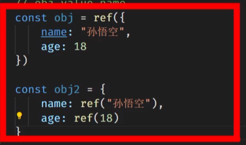

# 选项式API

选项式API是在**配置对象**中添加配置项

```vue
<template>
  <div>
    
    <HelloWorld msg="Hello Vue 3.0 + Vite" />
    <HelloWorld msg="Hello Vue 3.0 + Vite" />
  </div>
</template>
<script>
import HelloWorld from './components/HelloWorld.vue'

export default {
  name: 'App',
  components: {
    HelloWorld
  },
  data(){
    this.name='Sam'
    return{
      msg:'Java'
    }
  }
}
</script>

```

# 组合式API

## setup

在setup中配置config：data、methods、computed

我们在setup中通过`return`来指定向外暴露的内容，暴露的内容可以在vm中使用

在组合式api中直接声明的变量就是一个普通的变量，不是响应式的变量。需要使用`reactive`函数

```js
import { reactive } from 'vue';

export default {
  setup() {
    let msg='hello world'
    const obj = reactive({
      name:'lai'
    })
    return {
      msg,
      obj
    }
  },
};
```

在`setup`中我们还可以写methods方法。

在选项式API中我们的methods的方法使用了data的数据我们还需要使用this取得。但是在组合式API中我们不再需要使用this得到data数据，因为他们都处于同一作用域下（setup）

## script setup

可以发现script中的有很多需要重复的语句，例如export default，return setup

```vue
<script>
import { reactive } from 'vue';
export default {
  setup() {
    let msg='hello world'
    const obj = reactive({
      name:'lai'
    })
    function f() {
      console.log(obj)
    }
    return {
      msg,
      obj,
      f,
    }
  },
};
</script>
```

使用`script setup`可以简化上述的写法：

```vue
<script setup>
import {reactive} from "vue";

let msg='hello world'
const obj = reactive({
  name:'lai'
})
function f() {
  console.log(obj)
}
</script>
```

### 



```js
obj.value.name
obj.value.age
obj2.name.value
obj2.age.value
```

## computed

由于不再使用this了，因此可以直接使用箭头函数

```js
const res=computed(() =>{
  return res+1
})
```

