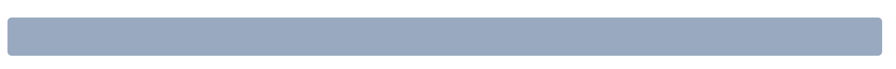
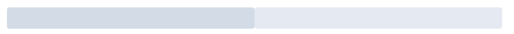

# 环境搭建


# 引入ElementUI

## 全量引入

```js
import Vue from 'vue'
import App from './App.vue'
// 引入ElementUI组件库
import ElementUI from 'element-ui';
// 引入ElementUI全部样式
import 'element-ui/lib/theme-chalk/index.css';
Vue.config.productionTip = false
Vue.use(ElementUI);
new Vue({
  render: h => h(App),
}).$mount('#app')

```

## 按需引入

借助 [babel-plugin-component](https://github.com/QingWei-Li/babel-plugin-component)，我们可以只引入需要的组件，以达到减小项目体积的目的。

首先，安装 babel-plugin-component：

```js
npm install babel-plugin-component -D
```

- main.js

引入组件时，将会自动引入CSS文件。

根据使用的模块，引入响应的模块，例如`Button`，`Select`，`Row`

```js
import Vue from 'vue'
import App from './App.vue'
Vue.config.productionTip = false
import { Button, Select,Row,DatePicker } from 'element-ui';
Vue.use(Button)
Vue.use(Select)
Vue.use(Row)
Vue.use(DatePicker)

new Vue({
  render: h => h(App),
}).$mount('#app')

```

在`babel.config.js`修改配置：

```js
module.exports = {
  presets: [
    '@vue/cli-plugin-babel/preset', ["@babel/preset-env", { "modules": false }]
  ],
  plugins: [
    [
      "component",
      {
        "libraryName": "element-ui",
        "styleLibraryName": "theme-chalk"
      }
    ]
  ]
}
```

# ElementUI阅读指南

所有的组件都以`el-XXXX`表示

```html
<el-row>
  <el-col :span="24"><div class="grid-content bg-purple-dark"></div></el-col>
</el-row>
```

# ICON

直接通过设置类名为 `el-icon-iconName` 来使用即可

```html
<i class="el-icon-edit"></i>
<i class="el-icon-share"></i>
<i class="el-icon-delete"></i>
<el-button type="primary" icon="el-icon-search">搜索</el-button>
```

# button

使用`el-button`创建按钮组件

```html
  <el-button>默认按钮</el-button>
  <el-button type="primary">主要按钮</el-button>
  <el-button type="success">成功按钮</el-button>
  <el-button type="info">信息按钮</el-button>
  <el-button type="warning">警告按钮</el-button>
  <el-button type="danger">危险按钮</el-button>
```

使用`type`、`plain`、`round`和`circle`属性来定义 Button 的样式。

icon类型的button

```html
<el-button type="danger" icon="el-icon-delete" circle></el-button>
```

# layout

## 24分栏

在element ui中将页面划分为多个`row`（行），每行最多`24col`(列)

element中 一行的组件为`el-row`，一列的组件为`el-col`

使用`:span`标签指定一个列元素占多少栅格（分类）

```html
<el-row>
  <el-col :span="24"><div class="grid-content bg-purple-dark"></div></el-col>
</el-row>

```

该行只有一列，该列占24份

```html
<el-row>
  <el-col :span="12"><div class="grid-content bg-purple"></div></el-col>
  <el-col :span="12"><div class="grid-content bg-purple-light"></div></el-col>
</el-row>
```

该行有2个列元素，每个列元素占12份



# FORM

##  Radio

```vue
<template>
    <div>
        <el-radio v-model="gender" label="man">Man</el-radio>
        <el-radio v-model="gender" label="woman">Woman</el-radio>
    </div>
  </template>
  
  <script>
    export default {
      data () {
        return {
          gender: ''
        };
      }
    }
  </script>
```

label：单选项的value

## checkbox

```vue
<template>
    <div>
        <el-checkbox-group v-model="city">
            <el-checkbox label="北京">北京</el-checkbox>
            <el-checkbox label="上海">上海</el-checkbox>
            <el-checkbox label="天津">天津</el-checkbox>
        </el-checkbox-group>

    </div>
  </template>
  <script>
    export default {
      data() {
        return {
          city:[],
        };
      }
    };
  </script>
```

多选框，label为每一个选项的value，该value会被v-model指定的变量所捕获，该变量需要为数组

## input


```vue
<template>
    <el-input v-model="input" placeholder="请输入内容"></el-input>
</template>

<script>
export default {
  data() {
    return {
      input: ''
    }
  }
}
</script>
```

### 带 icon 的输入框

可以通过 `prefix-icon` 和 `suffix-icon` 属性在 input 组件首部和尾部增加显示图标，也可以通过 slot 来放置图标。

```vue
    <el-input
      placeholder="请选择日期"
      suffix-icon="el-icon-date"
      v-model="input">
    </el-input>
```

